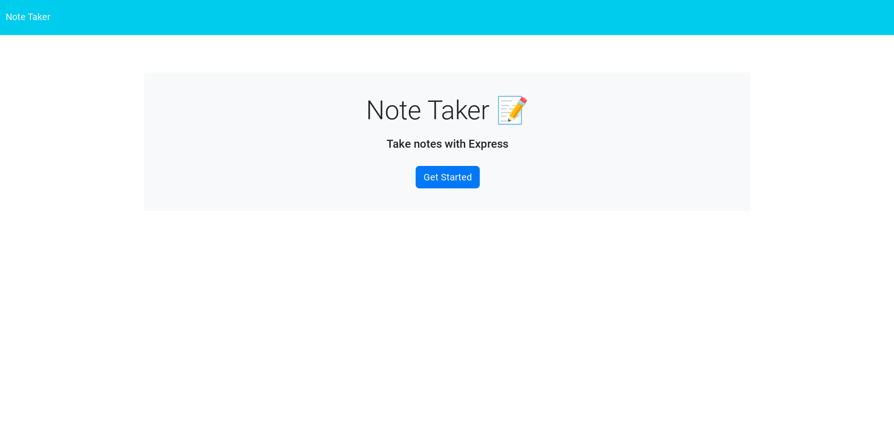
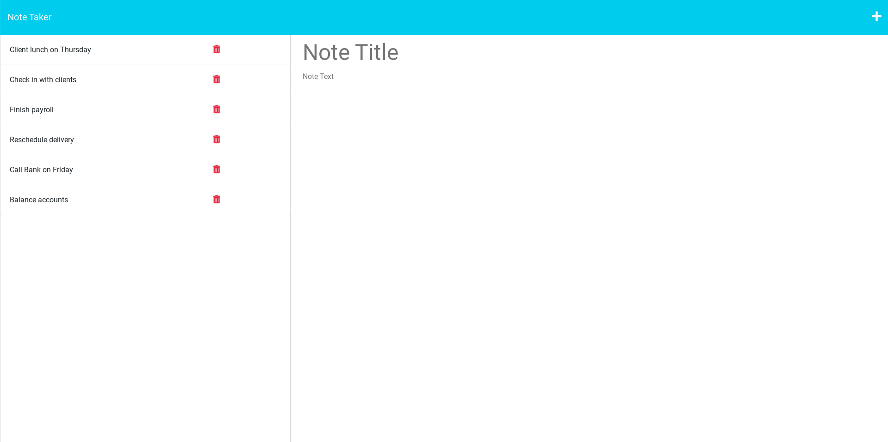

# Note Taker App


## Description

A simple note app using Express to store notes to JSON and deployed to Heroku

## Deployed Link

[Deployed Link](https://note-taker-app34.herokuapp.com/)

## Table of Contents

* [Screenshots](#screenshots)

* [Installation](#installation)

* [Usage](#usage)

* [License](#license)

* [Contributing](#contributing)

* [Tests](#tests)

* [Questions](#questions)

## Screenshots





## Installation

To install necessary dependencies, run the following command:

```
npm i
```

## Usage

To start the server, run the following command:

```
npm start
```

## License

This project is licensed under the MIT license.

## Contributing

N/A

## Test

N/A

## Questions

If you have any questions about the repo, open an issue or contact me directly at jason.lieb@outlook.com. You can find more of my work at [github](https://github.com/jason-lieb/).
